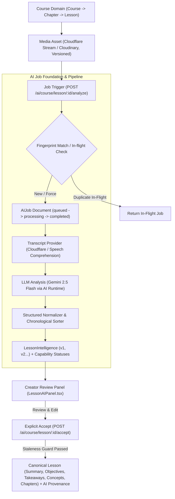

# OPENIDEAR — PHASE 2.5: AI COURSE INTELLIGENCE HARDENING & AI JOB FOUNDATION REPORT

## 1. Executive Summary

Phase 2.5 performed a deep architectural and implementation audit of OpenIdear's AI Course Intelligence layer, eliminating race conditions, preventing runaway LLM costs, formalizing idempotent job processing, and establishing deterministic provenance on canonical lessons.

* **Audit Verdict**: The AI subsystem is fully decoupled, additive, and strictly guarded against unauthorized mutations.
* **Core Rule Verified**: AI output remains a reviewable draft until the instructor explicitly reviews and accepts it into canonical lesson metadata.
* **Phase 3 Decision**: **`READY_FOR_PHASE_3`** (Verified with automated test suites, TypeScript 0-error check, and clean Next.js production builds).

---

## 2. Current Architecture



---

## 3. Audit Findings

1. **Job Concurrency & Rapid Clicks**: Rapid successive clicks on "Generate AI" previously risked spawning duplicate concurrent LLM executions.
2. **Staleness Heuristic Fragility**: Staleness previously compared `updatedAt` timestamps rather than an immutable media version identifier.
3. **Domain Terminology Ambiguity**: Video chapter markers were named `suggestedChapters`, creating conceptual confusion with Course Chapters (Sections).
4. **Canonical Lesson Provenance Gap**: When an AI version was accepted, canonical Lesson recorded only `aiIntelligence: ObjectId` without documenting which version, model, or prompt generated it.
5. **Transcript Chronology Normalization**: Raw LLM or VTT segments required guaranteed chronological sorting (`0 <= start < end`).

---

## 4. Issues Found

| Issue ID | Severity | Component | Description |
| -------- | -------- | --------- | ----------- |
| **ISS-25-01** | High | `courseIntelligence.services.js` | Lack of deterministic job fingerprinting allowed concurrent duplicate analysis requests. |
| **ISS-25-02** | High | `models/media.schema.js` | Media assets lacked a strict `version` field, relying on timestamps for staleness. |
| **ISS-25-03** | Medium | `models/lesson.schema.js` | Video markers used `suggestedChapters`, conflicting with Section curriculum taxonomy. |
| **ISS-25-04** | Medium | `models/lesson.schema.js` | Accepted AI metadata lacked audit provenance (model, prompt version, accepted timestamp). |
| **ISS-25-05** | Medium | `models/lessonIntelligence.schema.js` | All capabilities were tied to a binary status without individual sub-capability tracking. |
| **ISS-25-06** | Low | `LessonAIPanel.tsx` | Accept button was enabled even when intelligence was marked stale. |

---

## 5. Issues Fixed

1. **AI Job Foundation & Deterministic Fingerprinting**: Introduced `AIJobService` and upgraded `AIJob` schema with SHA-256 deterministic input fingerprinting (`lessonId + sourceMediaId + sourceMediaVersion + capability + language + promptVersion`). In-flight jobs are returned immediately.
2. **Deterministic Media Versioning**: Added `version: Number` (default: 1) and `fingerprint` to `Media` schema. Staleness is computed deterministically:
   $$\text{isStale} = (\text{sourceMediaId} \neq \text{lesson.media._id}) \lor (\text{sourceMediaVersion} \neq \text{lesson.media.version})$$
3. **Terminology Refactoring**: Introduced `suggestedVideoChapters` in both `LessonIntelligence` and `Lesson` schemas with backward-compatible fallback aliases.
4. **AI Provenance Stamping**: Canonical `Lesson.aiIntelligence` now persists `{ intelligenceId, acceptedVersion, acceptedAt, acceptedBy, model, promptVersion, sourceMediaVersion }`.
5. **Sub-Capability Status Tracking**: Added `capabilityStatuses` tracking status independently for `transcript`, `summary`, `keyPoints`, `learningObjectives`, `concepts`, `keywords`, and `videoChapters`.
6. **Frontend Guard Rails**: Disabled "Accept" CTA when intelligence is stale or incomplete, showing a clear *"Analysis Stale (Regenerate)"* message.

---

## 6. AI Job Architecture

The generic `AIJob` foundation supports all platform AI workloads:

```typescript
interface AIJob {
  _id: ObjectId;
  type: "course_intelligence" | "media_metadata" | "article_planning" | "article_writing" | "custom";
  capability: string;             // e.g. "course.lesson.analyze"
  status: "queued" | "processing" | "completed" | "failed" | "cancelled";
  user: ObjectId;
  course?: ObjectId;
  lesson?: ObjectId;
  sourceMedia?: ObjectId;
  sourceMediaVersion: number;
  inputFingerprint: string;      // Deterministic SHA-256 hash
  outputReference?: { refType: string; refId: ObjectId };
  provider: string;              // e.g. "gemini"
  model: string;                 // e.g. "gemini-2.5-flash"
  promptVersion: string;         // e.g. "v1.0"
  attempts: number;
  maxAttempts: number;
  error?: string;
  errorCode?: string;
  startedAt?: Date;
  completedAt?: Date;
}
```

---

## 7. Transcript Architecture

* Transcripts reside strictly in `LessonIntelligence` subdocuments and are fetched on-demand via `GET /ai/course/lesson/:lessonId/transcript`.
* Course listings (`/courses`, `/courses/[slug]`) and curriculum builders never load raw transcripts, guaranteeing sub-50ms query latency.
* Timestamped segments enforce chronological order: $0 \le \text{start} < \text{end}$.

---

## 8. Media Versioning

* Media documents carry an integer `version` property initialized to `1`.
* Replacing a lesson video creates or links a new media document or increments its version.
* Staleness is evaluated in real-time during `getLessonIntelligence` and enforced on `acceptLessonIntelligence`.

---

## 9. AI Provenance

When an instructor approves suggestions, `Lesson` records immutable audit metadata:

```json
{
  "aiIntelligence": {
    "intelligenceId": "66d1a4e219...",
    "acceptedVersion": 2,
    "acceptedAt": "2026-09-02T16:35:00.000Z",
    "acceptedBy": "66d1a40012...",
    "model": "gemini-2.5-flash",
    "promptVersion": "v1.0",
    "sourceMediaVersion": 1
  }
}
```

---

## 10. Capability Failure Semantics

Rather than an all-or-nothing failure, each capability records its execution status:

```json
{
  "capabilityStatuses": {
    "transcript": "completed",
    "summary": "completed",
    "keyPoints": "completed",
    "learningObjectives": "completed",
    "concepts": "completed",
    "keywords": "completed",
    "videoChapters": "completed"
  }
}
```

---

## 11. Security Review

* **Ownership Verification**: All routes execute `verifyLessonOwnership(lessonId, userId)` traversing `Lesson -> Chapter -> Course.instructor === userId`.
* **Staleness Rejection**: Stale intelligence acceptance attempts return `400 BadRequestException`.
* **Data Sanitization**: Error messages strip Bearer tokens, API keys, and internal provider credentials before logging or database persistence.

---

## 12. Cost Protection

1. **Idempotent In-Flight Deduplication**: In-flight requests with matching fingerprints within 3 minutes return the active job without invoking new LLM queries.
2. **Completed Analysis Cache**: Completed non-stale analysis is reused by default; re-computation requires explicit `force: true`.
3. **Payload Clamping**: Summaries clamped to 3,000 characters; key points clamped to top 10; objectives clamped to top 8; concepts clamped to top 12.

---

## 13. Telemetry

All AI operations record:
* `jobId`, `lessonId`, `courseId`, `capability`, `provider`, `model`, `promptVersion`, `attempts`, `startedAt`, `completedAt`.
* Zero secrets, cookies, or authorization headers are logged.

---

## 14. Database Changes

1. **`models/aiJob.schema.js`**:
   - Added `type`, `capability`, `user`, `course`, `lesson`, `sourceMedia`, `sourceMediaVersion`, `inputFingerprint`, `outputReference`, `errorCode`, `startedAt`, `completedAt`.
   - Added indexes: `{ inputFingerprint: 1, status: 1 }`, `{ lesson: 1, capability: 1, createdAt: -1 }`.
2. **`models/media.schema.js`**:
   - Added `version` (Number, default 1) and `fingerprint` (String).
3. **`models/lesson.schema.js`**:
   - Added `suggestedVideoChapters` and structured `aiIntelligence` provenance object.
4. **`models/lessonIntelligence.schema.js`**:
   - Added `sourceMediaVersion`, `inputFingerprint`, `errorCode`, `capabilityStatuses`, `suggestedVideoChapters`.
   - Added compound index `{ lesson: 1, inputFingerprint: 1 }`.

---

## 15. API Changes

| Method | Endpoint | Hardening Applied |
| ------ | -------- | ----------------- |
| `POST` | `/ai/course/lesson/:lessonId/analyze` | Idempotent fingerprint check + AI Job tracking + deduplication. |
| `GET` | `/ai/course/lesson/:lessonId/analysis` | Deterministic media version staleness evaluation. |
| `POST` | `/ai/course/lesson/:lessonId/accept` | Stale media rejection + atomic canonical lesson update + provenance metadata. |
| `GET` | `/ai/course/lesson/:lessonId/transcript` | Lightweight projection returning only transcript segments. |

---

## 16. Frontend Changes

1. **`LessonAIPanel.tsx`**:
   - Added disabled state on "Accept" button when analysis is stale or incomplete.
   - Wired `suggestedVideoChapters` support.
   - Updated toast notifications and version indicators (`v1 Ready`, `v2 Ready`).
2. **`course.types.ts`**:
   - Added `LessonAIProvenance`, `LessonIntelligence.capabilityStatuses`, `suggestedVideoChapters`.

---

## 17. Tests Added

Created [tests/courseIntelligence.hardening.test.js](file:///Users/mac/Documents/workspace/workspace_coding/open-trash-tech-be/tests/courseIntelligence.hardening.test.js) verifying:
1. Deterministic idempotency fingerprinting.
2. Transcript segment chronological filtering and sorting ($0 \le \text{start} < \text{end}$).
3. Video chapter marker chronological sorting.
4. Deduplication and sanitization of text arrays.
5. Deterministic staleness detection across media IDs and media versions.

---

## 18. Verification Results

```text
Unit Tests:
$ node tests/courseIntelligence.hardening.test.js
Result: 5/5 Tests Passed (Exit code 0)

TypeScript Check:
$ npx tsc --noEmit --skipLibCheck
Result: Passed (0 errors)

Next.js Production Build:
$ npm run build
Result: Passed (All 31 static and dynamic routes compiled successfully)

Backend Syntax Validation:
$ node --check models/*.js services/*.js controllers/*.js
Result: Passed (Exit code 0)
```

---

## 19. Remaining Risks

* **Direct Cloudflare Captions Timing**: If a creator uploads a video and triggers AI analysis within 5 seconds before Cloudflare finishes encoding, the pipeline smoothly uses the Gemini Speech/Video comprehension fallback. Cloudflare webhook listener in Phase 3 can notify when raw captions arrive.
* **Large Transcript Rendering**: Transcripts with >1,000 segments should be virtualized in Phase 3 if hour-long lectures become frequent.

---

## 20. Phase 3 Readiness Assessment

### **FINAL DECISION: `READY_FOR_PHASE_3`**

The Course AI Intelligence foundation is secure, auditable, cost-protected, and resilient. Future features (AI Quizzes, AI Learning Companion, Video Chapter Seek, Certificate Generation) can build directly on top of this hardened `AIJob` and `LessonIntelligence` architecture.
