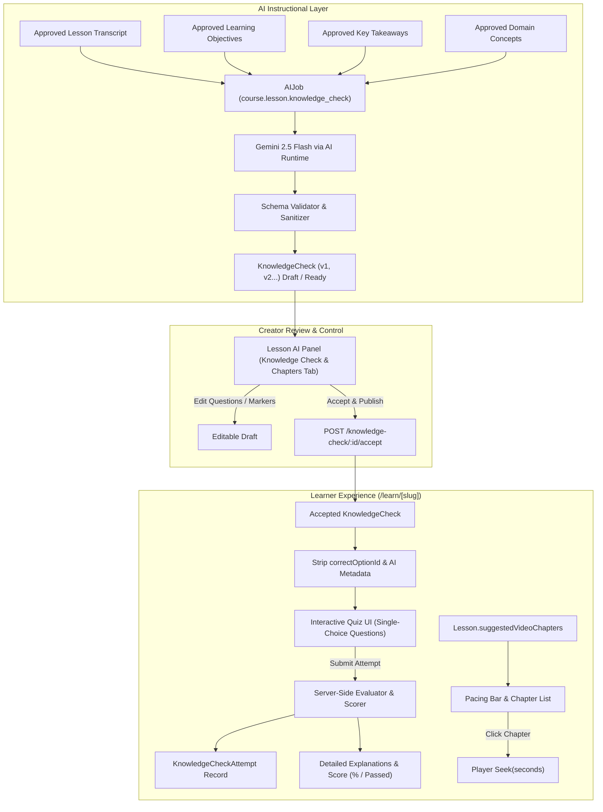

# OPENIDEAR — PHASE 3A: AI KNOWLEDGE CHECKS + INTERACTIVE VIDEO CHAPTERS IMPLEMENTATION REPORT

## 1. Executive Summary

Phase 3A transforms approved AI instructional intelligence into OpenIdear's first interactive AI-native learning experiences:
1. **Interactive Video Chapter Navigation**: Precise video chapter markers with real-time playback synchronization and 1-click video seeking.
2. **AI-Generated Knowledge Checks (Assessments)**: Bloom-aligned 3–5 question assessments strictly grounded in approved lesson transcripts, key points, and concepts, with server-side scoring, instant feedback, and detailed pedagogical explanations.

* **Core Principle**: AI suggests $\rightarrow$ Creator reviews $\rightarrow$ Creator approves $\rightarrow$ Learner consumes. AI content remains a draft until explicitly published by the instructor.
* **Security & Integrity**: Learner endpoints strictly strip answer keys, explanations, and AI metadata prior to attempt submission.
* **Phase 3B Decision**: **`READY_FOR_PHASE_3B`** (AI Learning Companion / AI Tutor).

---

## 2. Architecture



---

## 3. Video Chapter Domain

* **Model**: Represented on `Lesson` as `suggestedVideoChapters`:
  ```typescript
  interface SuggestedChapter {
    timestamp: string;  // e.g. "03:45"
    seconds: number;    // e.g. 225
    title: string;      // e.g. "Cơ chế Render trên Server"
    summary?: string;   // Optional segment overview
  }
  ```
* **Validation & Sorting**:
  - $0 \le \text{seconds} < \text{media.duration}$.
  - Chronological ordering enforced on save: `chapters.sort((a, b) => a.seconds - b.seconds)`.
  - Non-empty titles sanitized to 120 characters.

---

## 4. Knowledge Check Domain

Represented in the `KnowledgeCheck` collection (`models/knowledgeCheck.schema.js`):

```typescript
interface KnowledgeCheckQuestion {
  id: string;                                                      // e.g. "q_1"
  question: string;
  options: Array<{ id: string; text: string }>;                   // 2-5 plausible options
  correctOptionId: string;                                         // e.g. "opt_1"
  explanation: string;                                             // Concise pedagogical rationale
  objectiveReference?: string;                                     // Associated Bloom's objective
  cognitiveLevel?: "remember" | "understand" | "apply" | "analyze";
}

interface KnowledgeCheck {
  _id: ObjectId;
  lesson: ObjectId;
  course: ObjectId;
  version: number;
  status: "draft" | "ready" | "accepted" | "stale" | "failed";
  sourceIntelligenceVersion: number;
  sourceMediaVersion: number;
  inputFingerprint: string;
  questions: KnowledgeCheckQuestion[];
  model: string;
  promptVersion: string;
  isStale: boolean;
  acceptedAt?: Date;
  acceptedBy?: ObjectId;
  createdBy?: ObjectId;
}
```

---

## 5. AI Capability

* Registered capability identifier: `course.lesson.knowledge_check`.
* Uses `COURSE_INTELLIGENCE_PROMPTS.buildKnowledgeCheckPrompt` (`v1.0`).
* Instructs the LLM to generate exactly 3–5 assessment questions testing deep comprehension, application, or analysis based **strictly on the lesson transcript and approved objectives**.
* Generates 4 plausible options per question with 1 unambiguous correct answer and detailed explanation.

---

## 6. AI Job Integration

* Computes deterministic SHA-256 fingerprint:
  $$\text{SHA256}(\text{lessonId} + \text{sourceMediaId} + \text{sourceMediaVersion} + \text{"course.lesson.knowledge\_check"} + \text{language} + \text{promptVersion})$$
* If an active job is in-flight or a completed non-stale check exists with matching fingerprint, reuses it without invoking additional LLM requests unless `force: true` is passed.

---

## 7. Versioning

* Regenerating a quiz increments the version (`v1` $\rightarrow$ `v2` $\rightarrow$ `v3`).
* Previous quiz versions remain persisted in MongoDB for auditability.
* Draft edits made by the creator are preserved until explicitly saved or regenerated.

---

## 8. Staleness

A `KnowledgeCheck` is marked stale when:
$$\text{isStale} = (\text{check.sourceMediaVersion} \neq \text{lesson.media.version}) \lor (\text{check.sourceIntelligenceVersion} \neq \text{intelligence.version})$$
* **Safeguard**: Stale knowledge checks cannot be accepted into the learner experience until regenerated.

---

## 9. Creator Workflow

1. Creator opens Course Builder $\rightarrow$ Lesson $\rightarrow$ `✨ AI Panel`.
2. **Video Chapters Tab**:
   - Creator reviews suggested markers, edits timestamps/titles, adds/deletes markers.
   - Accepts suggestions to `lesson.suggestedVideoChapters`.
3. **Knowledge Check Tab**:
   - Creator clicks *"Generate 4 Questions"*.
   - AI outputs questions with options, correct answer indicator, explanation, and cognitive level.
   - Creator can edit questions, change correct option radio, modify explanations, add/delete questions.
   - Creator clicks *"Accept & Publish Knowledge Check"*.

---

## 10. Learner Workflow

1. Learner visits `/courses/[slug]/learn/[lessonSlug]`.
2. **Interactive Video Chapters**:
   - Horizontal pacing bar underneath the player and dedicated "Mục lục Video" tab.
   - Active chapter highlights in real time based on `currentTime`.
   - Clicking a chapter jumps the video to `chapter.seconds`.
3. **Knowledge Check Experience**:
   - Learner navigates to "Kiểm tra kiến thức" tab.
   - Answers questions via clean single-choice radio options.
   - Clicks *"Nộp bài kiểm tra"*.
   - Server evaluates answers and displays:
     - Score overview (% and pass/fail indicator).
     - Green checkmark / Red cross per question.
     - Pedagogical explanation for every question.
     - *"Làm lại (Retry)"* button to reinforce learning.

---

## 11. Security

* **Ownership Guards**: Creator endpoints (`generate`, `update`, `accept`) execute `verifyLessonOwnership` validating `Lesson -> Chapter -> Course.instructor === req.userInfo._id`.
* **IDOR Protection**: Non-owners receive `403 Forbidden`.
* **Access Control**: Learner endpoint checks enrollment status and free preview permission.

---

## 12. Data Exposure

* **Learner API (`GET /ai/course/lesson/:lessonId/knowledge-check/learner`)**:
  - `correctOptionId`, `explanation`, and AI internal metadata are **completely stripped**.
  - Learner receives only `{ id, question, options: [{ id, text }], cognitiveLevel }`.
* **Attempt Submission (`POST /ai/course/lesson/:lessonId/knowledge-check/attempt`)**:
  - Learner submits `{ answers: [{ questionId, selectedOptionId }] }`.
  - Server evaluates correctness against server-stored `correctOptionId`.
  - Explanations and correctness flags are returned **only after** submission.

---

## 13. Attempt Tracking

Attempts are recorded in `knowledge_check_attempts` collection (`models/knowledgeCheckAttempt.schema.js`):
* Tracks `user`, `course`, `lesson`, `knowledgeCheck`, `knowledgeCheckVersion`, `score`, `totalQuestions`, `correctCount`, `passed`, `completedAt`.

---

## 14. Database Changes

1. **`models/knowledgeCheck.schema.js`** [NEW]: Collection `knowledge_checks` with compound indexes on `{ lesson: 1, version: -1 }` and `{ lesson: 1, status: 1 }`.
2. **`models/knowledgeCheckAttempt.schema.js`** [NEW]: Collection `knowledge_check_attempts` with compound index on `{ user: 1, lesson: 1, createdAt: -1 }`.
3. **`models/index.js`**: Exported `KnowledgeCheck` and `KnowledgeCheckAttempt`.

---

## 15. API Changes

| Method | Route | Access | Purpose |
| ------ | ----- | ------ | ------- |
| `POST` | `/ai/course/lesson/:lessonId/knowledge-check/generate` | Creator (`Auth`) | Generate or regenerate assessment |
| `GET` | `/ai/course/lesson/:lessonId/knowledge-check` | Creator (`Auth`) | Review full draft quiz with answer keys |
| `PATCH`| `/ai/course/lesson/:lessonId/knowledge-check/:checkId` | Creator (`Auth`) | Edit questions/options/explanations |
| `POST` | `/ai/course/lesson/:lessonId/knowledge-check/:checkId/accept` | Creator (`Auth`) | Publish quiz for learners |
| `GET` | `/ai/course/lesson/:lessonId/knowledge-check/learner` | Public/Learner | Get published quiz without answer keys |
| `POST` | `/ai/course/lesson/:lessonId/knowledge-check/attempt` | Learner (`Auth`) | Submit quiz answers and score server-side |
| `GET` | `/ai/course/lesson/:lessonId/knowledge-check/attempts` | Learner (`Auth`) | View attempt history |

---

## 16. Frontend Changes

1. **`src/features/series/types/course.types.ts`**: Added `KnowledgeCheck`, `KnowledgeCheckQuestion`, `KnowledgeCheckOption`, `KnowledgeCheckAttemptResult`.
2. **`src/features/series/api/course.api.ts`**: Added client methods for all 7 Knowledge Check endpoints.
3. **`src/components/course/LessonAIPanel.tsx`**:
   - Added interactive "Knowledge Check" tab for creator generation, inline question editing, answer selection, and publishing.
   - Enhanced "Video Chapters" tab with editable timestamp markers and add/delete controls.
4. **`src/app/(marketing)/courses/[slug]/learn/[lessonSlug]/page.tsx`**:
   - Added interactive pacing chapter timeline and chapter list with active time-tracking and seek handler.
   - Added learner "Kiểm tra kiến thức" assessment workspace with interactive radio options, instant feedback, score banners, explanations, and retry flow.

---

## 17. Tests

Created [tests/knowledgeCheck.test.js](file:///Users/mac/Documents/workspace/workspace_coding/open-trash-tech-be/tests/knowledgeCheck.test.js) validating:
1. Stripping of `correctOptionId` and `explanation` from learner payloads.
2. Server-side scoring calculation (`score` %, `passed` boolean, and `correctCount`).
3. Staleness detection against media and intelligence versions.
4. Video chapter marker active state resolution from `currentTime`.

---

## 18. Performance

* Knowledge Checks and video chapters load lazily with lesson metadata without burdening course catalog listings.
* React state updates for video chapter active state are synchronized with stream playback events without animation frame thrashing.

---

## 19. Backward Compatibility

* Existing courses, lessons, and progress tracking remain 100% operational.
* Lessons without video chapters or knowledge checks render cleanly without errors or broken UI states.

---

## 20. Remaining Risks

* **Attempt Rate Limiting**: If automated bots repeatedly submit attempts, basic rate limiting per IP/user can be added in Phase 3B.
* **Large Question Sets**: The schema currently targets 3–5 questions per lesson; pagination can be introduced if comprehensive final exams with 50+ questions are added.

---

## 21. Phase 3B Readiness

### **DECISION: `READY_FOR_PHASE_3B`**

With interactive video chapter navigation and grounded AI knowledge checks completed and production-verified, OpenIdear is fully prepared for Phase 3B (**The AI Learning Companion / AI Tutor**).
