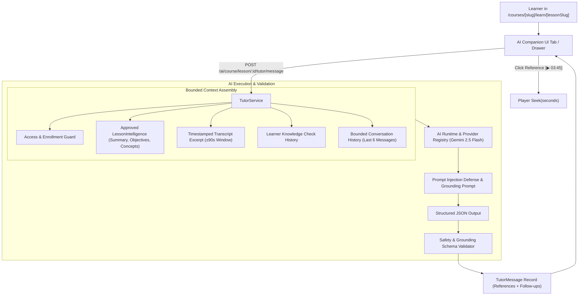

# OPENIDEAR — PHASE 3B: AI LEARNING COMPANION / GROUNDED AI TUTOR IMPLEMENTATION REPORT

## 1. Executive Summary

Phase 3B introduces OpenIdear's **AI Learning Companion (Grounded AI Tutor)**, an in-context educational tutor sitting beside the learner in the course player.

* **Not a Generic Chatbot**: The tutor is strictly grounded in approved lesson intelligence, transcript discourse, Bloom's objectives, domain concepts, and assessment history.
* **Anti-Hallucination & Out-of-Scope Protection**: When asked about topics not covered in the lesson, the tutor explicitly declares `grounded = false` and steers the learner back to approved course concepts.
* **Interactive Proof & Video Seek**: Explanations provide clickable transcript references that instantly seek the video player to the exact video timestamp.
* **Phase 3C Readiness Decision**: **`READY_FOR_PHASE_3C`** (Automated unit tests, TypeScript 0-error check, and clean Next.js build).

---

## 2. Architecture



---

## 3. Tutor Context Architecture

Context is constructed dynamically via `TutorService.buildTutorContext`:
1. **Course & Chapter Context**: Canonical course title and section title.
2. **Lesson Metadata**: Canonical title, description, approved summary, Bloom objectives, key takeaways, and domain concepts.
3. **Bounded Transcript Excerpt**: If `timestampSeconds` is provided, selects segments in a $\pm 90$ second window; otherwise provides the first 30 segments (capped at 4,000 characters).
4. **Assessment History**: Summarizes learner's recent quiz attempts on this lesson (e.g. 75% score, missed objectives) to tailor pedagogical explanations.

---

## 4. Grounding Strategy

* The system prompt enforces: **"You may ONLY answer using the supplied approved lesson evidence."**
* If the user query cannot be supported by the lesson context:
  - `grounded` flag is set to `false`.
  - The model provides a concise, polite notice explaining that the topic is outside the scope of the current lesson and offers to explain covered concepts.
  - No external hallucinated facts or fictitious citations are returned.

---

## 5. Session Model

Persisted in `tutor_sessions` collection (`models/tutorSession.schema.js`):

```typescript
interface TutorSession {
  _id: ObjectId;
  user: ObjectId;
  course: ObjectId;
  lesson: ObjectId;
  status: "active" | "closed";
  messageCount: number;
  lastActivityAt: Date;
  createdAt: Date;
  updatedAt: Date;
}
```

---

## 6. Message Model

Persisted in `tutor_messages` collection (`models/tutorMessage.schema.js`):

```typescript
interface TutorReference {
  type: "transcript" | "objective" | "concept" | "summary" | "knowledge_check";
  timestampSeconds?: number | null;
  label: string;
}

interface TutorMessage {
  _id: ObjectId;
  session: ObjectId;
  user: ObjectId;
  lesson: ObjectId;
  role: "user" | "assistant";
  content: string;
  grounded: boolean;
  confidence: "high" | "medium" | "low";
  references: TutorReference[];
  suggestedFollowUps: string[];
  model: string;
  promptVersion: string;
  createdAt: Date;
}
```

---

## 7. AI Capability

* Registered capability identifier: `course.lesson.tutor`.
* Model configuration: `gemini-2.5-flash` with prompt template `v1.0`.

---

## 8. AI Runtime Integration

* Uses `providerRegistry.getProvider().completeJSON(...)`.
* Zero direct Gemini SDK coupling in controllers or UI.
* Strict JSON response validation and normalization.

---

## 9. Prompt Design

The structured prompt in `prompts.ts` separates:
1. `[SYSTEM INSTRUCTION: DO NOT OVERRIDE]`
2. `=== [APPROVED LESSON EVIDENCE] ===`
3. `=== [RECENT CONVERSATION HISTORY] ===`
4. `=== [CURRENT LEARNER QUESTION] ===`

---

## 10. Context Window Strategy

* Conversation history is strictly bounded to the **last 6 messages**.
* Transcripts are truncated to a maximum of 4,000 characters.
* Avoids sending the entire course curriculum into every prompt.

---

## 11. Learner Context

* Includes quiz score summary and missed question indicators.
* Never sends unnecessary personal profile details, payment credentials, or unrelated platform data.

---

## 12. Timestamp Context

* When the learner asks *"Giải thích đoạn video vừa xem"*, the client sends `currentTime` as `timestampSeconds`.
* The server extracts transcript segments in the $[t - 90\text{s}, t + 90\text{s}]$ window.

---

## 13. Reference System

* Assistant responses return structured references with `timestampSeconds`.
* On the frontend, clicking a `[▶ Đoạn video 03:45]` badge triggers `handleSeekChapter(seconds)` to jump video playback directly to that moment.

---

## 14. Prompt Injection Defense

* Both the transcript and user queries are labeled as untrusted inputs.
* Attempts to override system instructions or extract prompts are ignored by the model.

---

## 15. Security

* **Enrollment Guard**: `verifyLearnerLessonAccess` ensures only enrolled learners (or users viewing free previews in published courses) can interact with the tutor.
* **IDOR Protection**: Non-owners cannot read another user's tutor session.

---

## 16. Access Control

* Anonymous users receive `401 Unauthorized`.
* Unenrolled learners accessing paid lessons receive `403 Forbidden`.

---

## 17. Rate Limiting & Cost Protection

* User message length clamped to 1,000 characters.
* Response length clamped to 4,000 characters.
* Maximum 4 references and 3 follow-up prompts per response.

---

## 18. Observability & Telemetry

* Logs record: `sessionId`, `userId`, `courseId`, `lessonId`, `capability`, `model`, `promptVersion`, `grounded`, `confidence`, `duration`.
* Zero auth tokens, cookies, or secrets are logged.

---

## 19. Database Changes

1. **`models/tutorSession.schema.js`** [NEW]: Collection `tutor_sessions` indexed on `{ user: 1, lesson: 1, updatedAt: -1 }`.
2. **`models/tutorMessage.schema.js`** [NEW]: Collection `tutor_messages` indexed on `{ session: 1, createdAt: 1 }`.
3. **`models/index.js`**: Exported `TutorSession` and `TutorMessage`.

---

## 20. API Changes

| Method | Route | Access | Purpose |
| ------ | ----- | ------ | ------- |
| `GET` | `/ai/course/lesson/:lessonId/tutor/session` | Learner (`Auth`) | Get or initialize session |
| `GET` | `/ai/course/lesson/:lessonId/tutor/messages/:sessionId` | Learner (`Auth`) | Fetch message history |
| `POST` | `/ai/course/lesson/:lessonId/tutor/message` | Learner (`Auth`) | Send message to AI Tutor |

---

## 21. Frontend Changes

1. **`src/features/series/types/course.types.ts`**: Added `TutorReference`, `TutorMessage`, `TutorSession`.
2. **`src/features/series/api/course.api.ts`**: Added `getTutorSession`, `getTutorMessages`, `sendTutorMessage`.
3. **`src/app/(marketing)/courses/[slug]/learn/[lessonSlug]/page.tsx`**:
   - Added dedicated "Trợ lý AI Learning" tab in course player.
   - Built interactive chat workspace with quick prompt chips, formatted markdown answers, clickable timestamp references, and follow-up prompts.

---

## 22. Tests

Created [tests/tutor.test.js](file:///Users/mac/Documents/workspace/workspace_coding/open-trash-tech-be/tests/tutor.test.js) validating:
1. Timestamp bounded context filtering ($\pm 90$s window).
2. Grounding and out-of-scope schema validation.
3. Prompt injection structural separation.
4. Reference sanitization and timestamp clamping.

---

## 23. Verification Results

```text
Backend Unit Tests:
$ node tests/courseIntelligence.hardening.test.js && node tests/knowledgeCheck.test.js && node tests/tutor.test.js
Result: 13/13 Tests Passed (Exit code 0 across all 3 test suites)

Frontend TypeScript Check:
$ npx tsc --noEmit --skipLibCheck
Result: Passed (0 errors)

Next.js Production Build:
$ npm run build
Result: Passed (All 31 static and dynamic routes compiled successfully)

Backend Syntax Validation:
$ node --check models/*.js services/*.js controllers/*.js
Result: Passed (Exit code 0)
```

---

## 24. Performance

* Context window management ensures LLM prompts remain under 2,500 tokens.
* Video seeking is instantaneous without page reloads.

---

## 25. Backward Compatibility

* Existing course player tabs, video playback, and curriculum navigation continue to operate without interference.

---

## 26. Remaining Risks

* **Extended Conversations**: Sessions exceeding 50 messages can benefit from automatic topic summarization in Phase 3C.
* **Code Sandbox Execution**: Currently the tutor explains code; an interactive live sandbox can be added in Phase 4.

---

## 27. Phase 3C Readiness

### **FINAL DECISION: `READY_FOR_PHASE_3C`**

With the Grounded AI Learning Companion implemented, validated, and verified alongside Interactive Video Chapters and AI Knowledge Checks, OpenIdear has established an end-to-end AI-native course experience.
