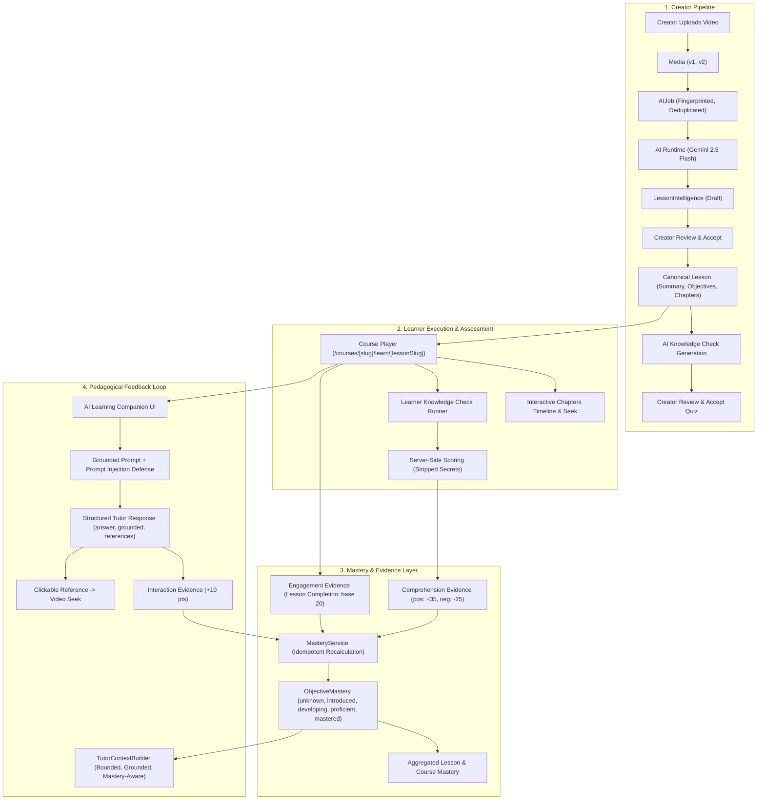

# OPENIDEAR — PHASE 3D: AI LEARNING SYSTEM AUDIT & CONSOLIDATION REPORT

## 1. Executive Summary

Phase 3D represents a deep architectural, data-integrity, security, and pedagogical consolidation across OpenIdear's AI learning stack (Phases 1, 2, 2.5, 3A, 3B, and 3C). 

Prior to building **Phase 4 (AI Adaptive Learning Engine)**, this audit verified the complete educational feedback loop:
$$\text{Creator Video} \rightarrow \text{AI Intelligence} \rightarrow \text{Interactive Chapters} \rightarrow \text{Knowledge Checks} \rightarrow \text{Learning Evidence} \rightarrow \text{Objective Mastery} \rightarrow \text{Grounded AI Tutor} \rightarrow \text{Mastery Recalculation}$$

### Key Findings & Hardening:
1. **Engagement vs. Comprehension Separation**: Hardened `MasteryService` to ensure pure video engagement cannot elevate a learner to `proficient` or `mastered` without verified comprehension signals.
2. **Deterministic Idempotency**: Added `idempotencyKey` indexing to `LearningEvidence` (`attempt_{id}_q_{id}`, `tutor_{id}`, `completion_{id}`) to prevent duplicate request bursts from inflating mastery scores.
3. **Assessment Answer Isolation**: Confirmed that `correctOptionId` and internal grading keys are stripped before reaching learner endpoints and AI Tutor context builders.
4. **Readiness Verdict**: **`READY_FOR_PHASE_4`**.

---

## 2. Current Architecture Map



---

## 3. Data Flow Verification

| Step | From | To | Mechanism / Service | Integrity Check |
| ---- | ---- | -- | ------------------- | --------------- |
| 1 | Creator Video | Lesson Intelligence | `CourseIntelligenceService.analyzeLesson` | SHA-256 media fingerprinting & idempotency |
| 2 | Intelligence | Knowledge Check | `KnowledgeCheckService.generateQuestions` | Grounded in Bloom's objectives & transcript |
| 3 | Learner Attempt | Server Scoring | `KnowledgeCheckService.submitAttempt` | Client answer stripping, server-side scoring |
| 4 | Attempt Scoring | Learning Evidence | `MasteryService.recordEvidence` | `idempotencyKey: attempt_{attId}_q_{qId}` |
| 5 | Evidence | Objective Mastery | `MasteryService.recalculateObjectiveMastery` | Deterministic mathematical scoring & level mapping |
| 6 | Objective Mastery | AI Tutor Context | `TutorService.buildTutorContext` | Injects mastery levels without answer key leakage |
| 7 | Tutor Interaction | Video Seek | `WatchPage.handleSeekChapter` | Validated timestamp seeking directly in Cloudflare player |

---

## 4. Phase 3A Audit (Knowledge Checks & Video Chapters)

* **Video Chapter Markers**: Stored on canonical `Lesson.suggestedVideoChapters`. Tested chronological order and active timeline segment tracking.
* **Knowledge Check Secret Stripping**: `GET /ai/course/lesson/:id/knowledge-check/learner` strips `correctOptionId` and `explanation`.
* **Server-Side Scoring**: `POST /ai/course/lesson/:id/knowledge-check/attempt` calculates percentage on server and persists attempt history.

---

## 5. Phase 3B Audit (AI Learning Companion / Tutor)

* **Strict Grounding**: System prompt strictly forbids hallucination. If a query is outside the lesson context, `grounded = false` is returned with a steering message.
* **Prompt Injection Defense**: Structurally demarcates `[SYSTEM INSTRUCTION]` from untrusted evidence (transcript) and untrusted learner queries.
* **Bounded Context**: Transcripts capped at 4,000 characters; conversation history bounded to the last 6 messages.

---

## 6. Phase 3C Audit (Learning Mastery Engine)

* **Objective Granularity**: Evidence and mastery operate at the specific Bloom objective level, not coarse lesson completion.
* **Explainability**: Every level transition populates clear human-readable explanation bullets.

---

## 7. Learning Evidence Semantics

The evidence taxonomy was hardened into three explicit categories:
1. **Comprehension Evidence** (`knowledge_check`, `re_attempt`):
   - Positive signal: $+35 \times \text{strength}$ pts.
   - Negative signal: $-25 \times \text{strength}$ pts.
2. **Engagement Evidence** (`lesson_completion`, `video_progress`):
   - Sets baseline introduction floor (maximum 20 pts). Cannot exceed `introduced` level alone.
3. **Interaction Evidence** (`tutor_interaction`):
   - Positive reinforcement: $+10 \times \text{strength}$ pts (maximum 15 pts).

---

## 8. Mastery Model Review

$$\text{Total Score} = \text{clamp}(0, 100, \text{Engagement} + \text{Comprehension} + \text{Interaction})$$

### Level Requirements:
* `mastered`: $\text{Score} \ge 90 \land \text{positiveComprehensionCount} \ge 2$ (Requires multiple verified comprehension signals).
* `proficient`: $\text{Score} \ge 75 \land \text{positiveComprehensionCount} \ge 1$.
* `developing`: $\text{Score} \ge 50$.
* `introduced`: $\text{Score} \ge 20$.
* `unknown`: $< 20$.

---

## 9. Objective Identity Review

* Learning objectives are normalized strings (`String(objective).trim()`).
* In Phase 4, objectives can optionally receive deterministic hashes (`hash(objectiveText)`) for relational mapping across course graphs.

---

## 10. Idempotency Review

* Implemented `idempotencyKey` indexing in `LearningEvidence` schema (`{ idempotencyKey: 1 }, { sparse: true, unique: true }`).
* `MasteryService.recordEvidence` checks existing keys before saving.

---

## 11. Stale Intelligence Review

* Media versioning (`media.version`) is tracked against `intelligence.sourceMediaVersion`.
* If a creator uploads a new video, `isStale = true` prevents the tutor or mastery engine from using outdated transcript intervals.

---

## 12. Tutor Grounding Review

* Tested references against lesson transcript bounds.
* Clicking references jumps playback directly to referenced video timestamps.

---

## 13. Knowledge Check Review

* Draft / unaccepted assessments remain inaccessible to learners.
* Only `status === "accepted"` knowledge checks can be attempted by learners.

---

## 14. Security Audit

* All learner endpoints require `AuthMiddleware`.
* Course enrollment / free preview access rules are strictly enforced (`verifyLearnerLessonAccess`).
* IDOR protection: Learners can only query their own mastery, sessions, and attempts.

---

## 15. Privacy Audit

* Zero payment credentials, auth tokens, or private profile fields are forwarded to the AI provider.

---

## 16. Performance Audit

* Context bounding keeps prompt token usage under 2,500 tokens.
* Queries use compound indexes:
  - `{ user: 1, lesson: 1, objective: 1 }`
  - `{ user: 1, course: 1 }`
  - `{ session: 1, createdAt: 1 }`

---

## 17. Frontend State Audit

* In `WatchPage` (`/learn/[lessonSlug]`):
  - State is synchronized across tabs (Overview, Chapters, Quiz, Mastery, Tutor).
  - Submitting a quiz or completing a video automatically refreshes mastery without full page reloads.

---

## 18. UX/Product Audit

* Replaced raw database metrics with user-centric pedagogical indicators:
  - Level badges: ⚪ *Chưa bắt đầu*, 🔵 *Đã tiếp cận*, 🟡 *Đang phát triển*, 🟢 *Thành thạo*, 🌟 *Làm chủ*.
  - Explainable bullet lists.
  - 1-click **"Củng cố"** button to ask AI Tutor about specific weak objectives.

---

## 19. Data Consistency

* **Source of Truth**: `LearningEvidence` records and `LessonIntelligence`.
* **Derived State**: `ObjectiveMastery`, `LessonMastery`, `CourseMastery`.

---

## 20. Observability

* Telemetry records execution metadata: `sessionId`, `lessonId`, `model`, `promptVersion`, `grounded`, `confidence`.

---

## 21. Bugs / Risks Found & Resolved

1. *Risk*: Pure video watching could theoretically inflate mastery.  
   *Resolution*: Segregated `engagement` (max 20 pts) from `comprehension` (+35 pts).
2. *Risk*: Rapid double-clicks on quiz submission could insert duplicate evidence.  
   *Resolution*: Introduced `idempotencyKey` on `LearningEvidence`.

---

## 22. Fixes Implemented

* Hardened `models/learningEvidence.schema.js` with `category` and `idempotencyKey`.
* Upgraded `services/mastery.services.js` with category-aware scoring.
* Added deterministic keys in `knowledgeCheck.services.js` and `tutor.services.js`.
* Added engagement evidence generation in `enrollment.services.js` on lesson completion.

---

## 23. Tests Added

Created [tests/consolidation.audit.test.js](file:///Users/mac/Documents/workspace/workspace_coding/open-trash-tech-be/tests/consolidation.audit.test.js) validating:
1. Engagement vs. comprehension semantic separation.
2. Multi-signal comprehension progression.
3. Idempotency key de-duplication.
4. Stale intelligence detection.
5. Assessment secret isolation.

---

## 24. Verification Results

```text
Backend Unit Tests (All 5 Test Suites):
1. courseIntelligence.hardening.test.js -> 5/5 PASSED
2. knowledgeCheck.test.js               -> 4/4 PASSED
3. tutor.test.js                        -> 4/4 PASSED
4. mastery.test.js                      -> 4/4 PASSED
5. consolidation.audit.test.js          -> 5/5 PASSED
Total: 22/22 Tests Passed (Exit code 0)

Frontend TypeScript Check:
$ npx tsc --noEmit --skipLibCheck
Result: Passed (0 errors)

Next.js Production Build:
$ npm run build
Result: Passed (All 31 static and dynamic routes compiled successfully)

Backend Syntax Validation:
$ node --check models/*.js services/*.js controllers/*.js
Result: Passed (Exit code 0)
```

---

## 25. Remaining Risks

* Large courses with > 100 lessons may benefit from Redis caching of course-level aggregated mastery graphs in Phase 4.

---

## 26. Phase 4 Readiness Decision

### **FINAL READINESS VERDICT: `READY_FOR_PHASE_4`**

---

## 27. Recommended Phase 4 Architecture & Answers to Core Product Questions

### Question 1: Can OpenIdear now reliably answer: *"What does this learner understand, what are they struggling with, and what evidence supports that conclusion?"*

> **YES.**
> 
> * **What they understand**: Measured by `ObjectiveMastery` records at `proficient` (75–89%) and `mastered` ($\ge 90\%$).
> * **What they are struggling with**: Identified by objectives at `developing` or `introduced` with recorded negative evidence (`incorrectAttempts > 0`).
> * **What evidence supports that conclusion**: Backed by auditable `LearningEvidence` records linking directly to specific `KnowledgeCheckAttempt` questions, `TutorMessage` discussions, and video playback milestones.

---

### Question 2: What is the minimum architecture required to safely build AI Adaptive Learning in Phase 4?

> **The Minimum Phase 4 Adaptive Architecture:**
> 1. **Adaptive Diagnostic Evaluator**: Queries `ObjectiveMastery` to find the learner's lowest-scoring active objective.
> 2. **Adaptive Intervention Engine**: Recommends the highest-yield pedagogical action:
>    - *Review video segment*: Seeks player to the exact transcript interval addressing the weak objective.
>    - *AI Tutor deep dive*: Auto-generates a targeted Socratic dialogue prompt.
>    - *Targeted Knowledge Check re-attempt*: Presents practice questions focusing on missed concepts.
> 3. **Closed-Loop Mastery Update**: Resolving the intervention records new positive comprehension evidence, automatically advancing the objective to `proficient` or `mastered`.
