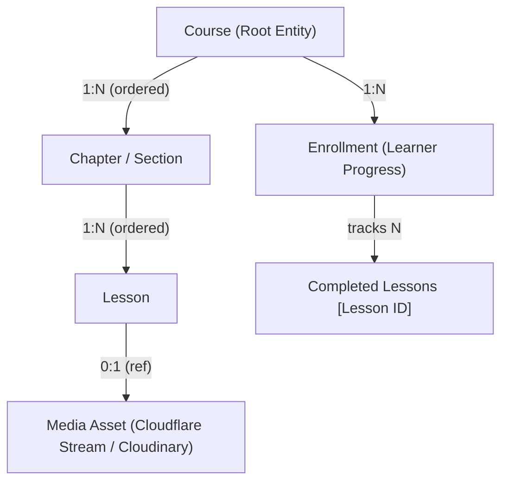
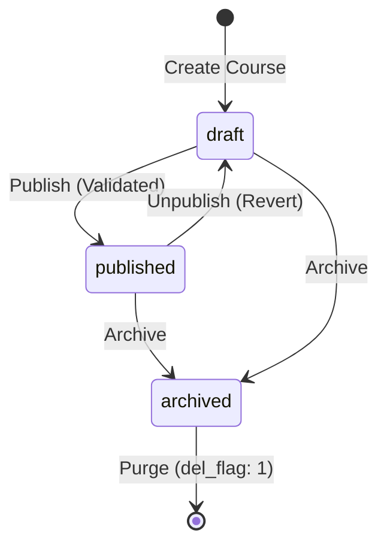
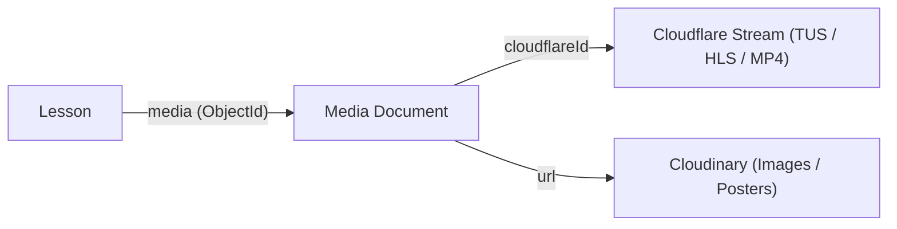

# OpenIdear — Course Domain Contract v1

This document defines the canonical domain model, entity lifecycles, access control rules, and extension points for the OpenIdear Course Platform.

---

## 1. Domain Overview & Hierarchy

The Course domain follows a clean hierarchical structure for curriculum authoring and an independent relational model for learner progression.



---

## 2. Course Structure Contract

### Course Entity
* **Identity**: `_id` (ObjectId), `slug` (unique string, URI friendly).
* **Metadata**: `title`, `description`, `thumbnail` (ref: Media), `category` (ref: Category), `topics` (ref: [Topic]).
* **Instructor**: `instructor` (ref: User, author & owner).
* **Pricing**: `price` (Number in VND, 0 = Free), `discountPrice` (Number, 0 or null if no discount).
* **Publication**: `status` (`draft` | `published` | `archived`), `del_flag` (0 = active, 1 = trashed).
* **Stats (Derived/Denormalized)**: `studentsCount` (Number), `averageRating` (Number), `ratingCount` (Number).
* **Curriculum Links**: `chapters` (Ordered array of Chapter ObjectIds).

### Chapter Entity (Section)
* **Identity**: `_id` (ObjectId).
* **Parent**: `course` (ref: Course, mandatory).
* **Metadata**: `title` (String, required).
* **Ordering**: `order` (Number, 0-indexed relative to siblings in the same course).
* **Child References**: `lessons` (Ordered array of Lesson ObjectIds).
* **Lifecycle**: `del_flag` (0 = active, 1 = deleted).

### Lesson Entity
* **Identity**: `_id` (ObjectId), `slug` (String, unique within course).
* **Parent**: `chapter` (ref: Chapter, mandatory).
* **Common Metadata**: `title` (String), `description` (String), `order` (Number), `isFreePreview` (Boolean).
* **Lesson Type**: `type` (`video` | `text` | `file` | `quiz` | `assignment` | `article`).
* **Content / Payload**:
  * For `text` / `article`: `content` (HTML/Markdown string).
  * For `video` / `file`: `media` (ref: Media).
* **Lifecycle**: `del_flag` (0 = active, 1 = deleted).

---

## 3. Course Lifecycle State Machine



### State Definitions:
1. **`draft`**:
   * Editable exclusively by the course instructor / admin.
   * Hidden from public catalog (`/courses`) and public search.
   * Public URLs (`/courses/[slug]`) return `404 NotFound` for unauthorized users.
   * New enrollments are strictly prohibited.
2. **`published`**:
   * Visible in public catalog and search listings.
   * Public course details accessible to all visitors.
   * Free / paid enrollment enabled.
   * Enrolled learners can access all lessons and track progress.
3. **`archived`**:
   * Hidden from public catalog and search.
   * New enrollments are disabled.
   * **Existing enrolled learners retain full access** to review lessons.

---

## 4. Publishing Validation Contract

A course can transition from `draft` to `published` if and only if all of the following conditions are met (authoritatively validated on backend):

1. `title`: Non-empty, trimmed string.
2. `description`: Non-empty, trimmed string.
3. `thumbnail`: Attached valid Media reference.
4. `curriculum`: At least **one active Chapter** (`del_flag: 0`).
5. `lessons`: The active Chapter contains at least **one active Lesson** (`del_flag: 0`).
6. `lesson titles`: All active lessons have non-empty titles.

---

## 5. Media & Cloudflare Stream Relationship



### Media Lifecycle Fields:
* `cloudflareId`: Direct UID from Cloudflare Stream (e.g., `5d531f18a598441407218320b4457235`).
* `url`: Direct playback/asset URL or Cloudflare video UID.
* `duration`: Runtime in seconds (default 0).
* `thumbnail`: Generated poster / thumbnail URL.
* `status`: `uploaded` | `processing` | `ready` | `failed`.

---

## 6. Access Control & Authorization Matrix

| Action | Visitor | Learner (Unenrolled) | Learner (Enrolled) | Instructor (Owner) | Admin |
| ------ | ------- | -------------------- | ------------------ | ------------------ | ----- |
| Browse Published Catalog | ✅ | ✅ | ✅ | ✅ | ✅ |
| View Published Detail (`/courses/[slug]`) | ✅ | ✅ | ✅ | ✅ | ✅ |
| View Draft Detail (`/courses/[slug]`) | ❌ (404) | ❌ (404) | ❌ (404) | ✅ | ✅ |
| Play Free Preview Lesson | ✅ | ✅ | ✅ | ✅ | ✅ |
| Play Paid Lesson | ❌ (Lock) | ❌ (Lock) | ✅ | ✅ | ✅ |
| Track / Complete Lesson | ❌ | ❌ | ✅ | N/A | N/A |
| Course Builder (`/curriculum`) | ❌ (403) | ❌ (403) | ❌ (403) | ✅ | ✅ |
| Edit Course / Chapter / Lesson | ❌ (403) | ❌ (403) | ❌ (403) | ✅ | ✅ |
| Publish / Unpublish Course | ❌ (403) | ❌ (403) | ❌ (403) | ✅ | ✅ |
| Delete / Soft Delete Course | ❌ (403) | ❌ (403) | ❌ (403) | ✅ | ✅ |

---

## 7. Enrollment & Progress Contract

### Single Source of Truth
* **`Enrollment` Collection** is the sole authoritative source of truth for learner progress and enrollment access.
* `Course.studentsCount` is a derived atomic counter (`$inc: 1`).
* `User.enrolledCourses` is a denormalized reference index for fast profile queries.

### Enrollment Schema:
```typescript
interface Enrollment {
  _id: ObjectId;
  user: ObjectId;            // Reference to learner
  course: ObjectId;          // Reference to enrolled course
  status: "active" | "completed" | "refunded" | "archived";
  progress: number;          // 0 to 100 percentage
  completedLessons: ObjectId[]; // Array of unique completed Lesson IDs
  lastLesson?: ObjectId;     // Most recently accessed lesson
  lastAccessedAt: Date;
  completedAt?: Date;        // Set when progress reaches 100%
  enrolledAt: Date;
}
```

### Progress Calculation Formula:
$$\text{progress} = \text{round}\left(\frac{\text{count}(\text{completedLessons} \cap \text{activeLessons})}{\text{totalActiveLessons}} \times 100\right)$$

---

## 8. Ordering Contract

* **Scope**: Ordering is strictly local to parent container.
  * Chapter order is relative to siblings in the same `Course` (`0, 1, 2, ...`).
  * Lesson order is relative to siblings in the same `Chapter` (`0, 1, 2, ...`).
* **Validation**: Reorder APIs (`PATCH /course/chapter/reorder` and `PATCH /course/lesson/reorder`) enforce:
  1. User owns the parent course.
  2. Every ID in `orderedIds` is valid and belongs to the parent container.
  3. No foreign or deleted IDs can be injected.

---

## 9. Slug Contract

* **Course Slug**: Unique across the entire platform (`courseSchema.index({ slug: 1 }, { unique: true })`).
  * Generated from `title` via `slugify(title, { lower: true, strict: true })`.
  * Collisions auto-append unique timestamp suffix: `${baseSlug}-${Date.now().toString(36)}`.
* **Lesson Slug**: Scoped to the course and URL path (`/courses/[slug]/learn/[lessonSlug]`).
  * Generated from lesson title + entropy suffix to prevent internal collision.

---

## 10. Soft Deletion & Cascading Rules

* Deleting a **Course** (`del_flag: 1`):
  * Course is moved to trash. Chapters and lessons retain internal links for recovery.
* Deleting a **Chapter** (`del_flag: 1`):
  * Cascades `del_flag: 1` to all child lessons.
  * Pulls `chapterId` from `Course.chapters`.
* Deleting a **Lesson** (`del_flag: 1`):
  * Pulls `lessonId` from parent `Chapter.lessons`.
  * Media assets are **preserved** (not purged immediately) to prevent accidental loss and enable restore.

---

## 11. Pricing Contract

* **Free Course**: `price === 0`.
  * Enables instant 1-click enrollment via `POST /course/enroll`.
* **Paid Course**: `price > 0`.
  * Has optional `discountPrice` (`0 < discountPrice < price`).
  * Effective checkout price: `discountPrice > 0 ? discountPrice : price`.
  * Requires payment processing before `Enrollment` creation.

---

## 12. Future Extension Points (Phase 2+)

The v1 domain structure is deliberately non-blocking for future modules:

| Extension Feature | Attachment Point | Implementation Strategy |
| ----------------- | ---------------- | ----------------------- |
| **AI Transcripts & Summaries** | `Lesson.media` / `Lesson.content` | Add `transcript` & `summary` fields or attach subdocument to `MediaAsset`. |
| **Quizzes & Assignments** | `Lesson.type = "quiz"` | Polymorphic payload attached to `Lesson.content` or `Lesson.quizId`. |
| **Certificates** | `Enrollment.completedAt` | Trigger certificate generation when `Enrollment.progress === 100`. |
| **Lesson Comments / Q&A** | `Comment.refId = Lesson._id` | Reuses existing `Comment` model keyed by lesson ObjectId. |
| **Production Payment Gateways** | `Payment.paymentGateway` | Extends `payment.services.js` (VNPay, Stripe webhooks). |
